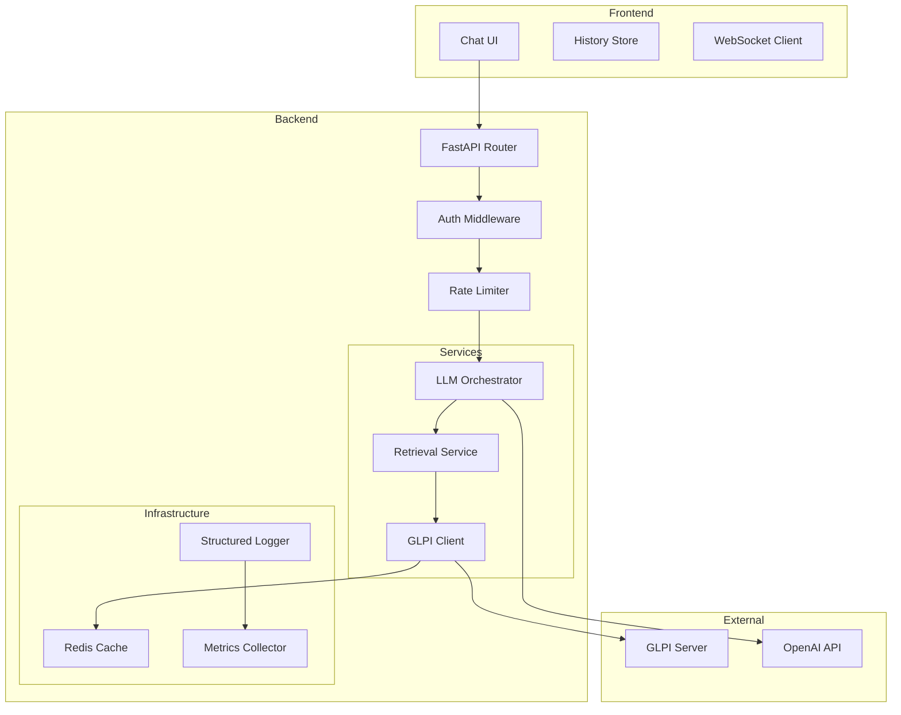
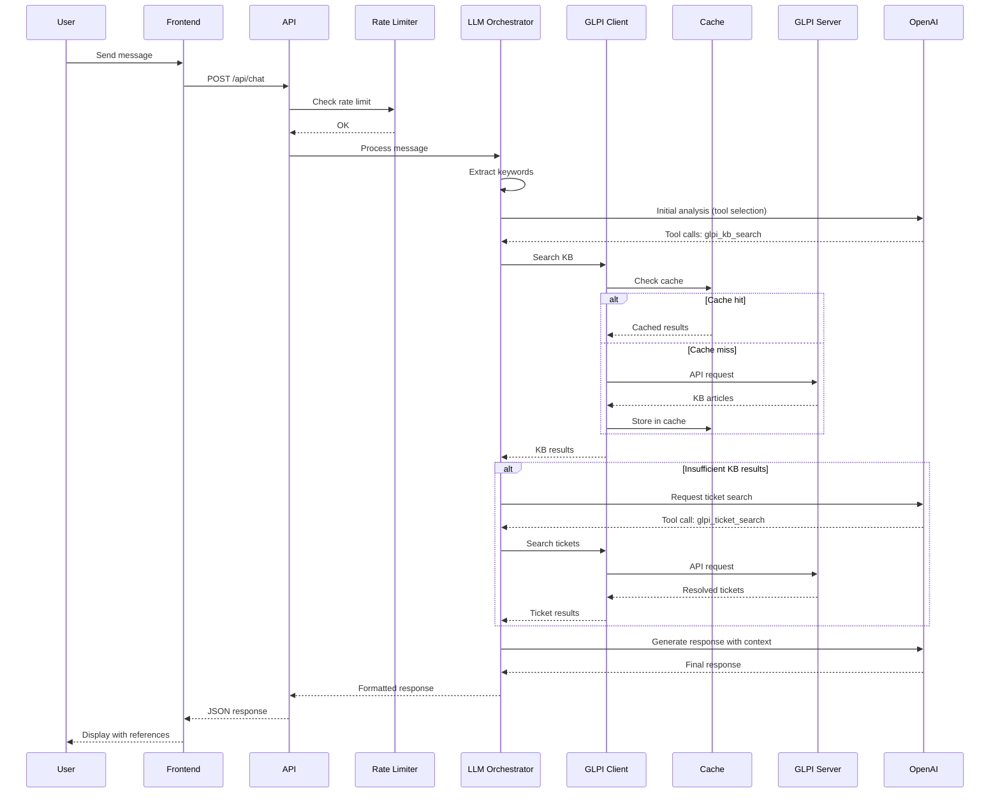

# Helpdesk AI - Architecture Documentation

## Overview

Helpdesk AI is a chat-based support system that leverages OpenAI's language models to provide intelligent responses grounded in GLPI (IT Service Management) data. The system queries GLPI's knowledge base and resolved tickets to provide accurate, verifiable answers.

## System Architecture

```
┌─────────────────────────────────────────────────────────────────────────────┐
│                              HELPDESK AI SYSTEM                             │
├─────────────────────────────────────────────────────────────────────────────┤
│                                                                             │
│  ┌─────────────┐     ┌──────────────────────────────────────────────────┐  │
│  │             │     │                  BACKEND (FastAPI)                │  │
│  │  FRONTEND   │     │  ┌────────────┐  ┌────────────┐  ┌────────────┐  │  │
│  │  (React)    │────▶│  │    API     │  │   GLPI     │  │    LLM     │  │  │
│  │             │     │  │  Router    │──│  Client    │──│ Orchestrator│  │  │
│  │  - Chat UI  │◀────│  │            │  │            │  │            │  │  │
│  │  - History  │     │  └────────────┘  └────────────┘  └────────────┘  │  │
│  │  - Refs     │     │        │              │               │          │  │
│  │             │     │        ▼              ▼               ▼          │  │
│  └─────────────┘     │  ┌────────────┐  ┌────────────┐  ┌────────────┐  │  │
│                      │  │   Cache    │  │  Session   │  │  Guardrails │  │  │
│                      │  │  (Redis)   │  │  Manager   │  │  & Security │  │  │
│                      │  └────────────┘  └────────────┘  └────────────┘  │  │
│                      │                                                   │  │
│                      └──────────────────────────────────────────────────┘  │
│                                        │                                    │
│                    ┌───────────────────┼───────────────────┐               │
│                    ▼                   ▼                   ▼               │
│             ┌────────────┐      ┌────────────┐      ┌────────────┐        │
│             │   GLPI     │      │   Redis    │      │  OpenAI    │        │
│             │  (REST)    │      │   Cache    │      │   API      │        │
│             └────────────┘      └────────────┘      └────────────┘        │
│                                                                             │
└─────────────────────────────────────────────────────────────────────────────┘
```

## Component Diagram (Mermaid)



## Request Flow Sequence



## Core Components

### 1. Frontend (React + TypeScript)

**Responsibilities:**
- Chat interface with message history
- Display loading states ("Searching GLPI...")
- Render references (KB_ID, TICKET_ID) as links
- Handle session management
- Form for optional ticket creation

**Key Features:**
- Responsive design
- Markdown rendering for responses
- Copy-to-clipboard for solutions
- Dark/light mode support

### 2. Backend API (FastAPI)

**Modules:**

#### 2.1 API Router (`/api`)
- `POST /api/chat` - Main chat endpoint
- `GET /api/health` - Health check
- `POST /api/ticket` - Create ticket (optional)
- `GET /api/session/{id}` - Get session history

#### 2.2 GLPI Client (`services/glpi_client.py`)
- Session management with token refresh
- Retry logic with exponential backoff
- Request/response mapping
- Error handling and logging

**GLPI Endpoints Used:**
| Endpoint | Purpose |
|----------|---------|
| `initSession` | Authenticate and get session token |
| `killSession` | End session |
| `KnowbaseItem` | Search/get KB articles |
| `Ticket` | Search/get tickets |
| `ITILSolution` | Get ticket solutions |
| `ITILFollowup` | Get ticket followups |

#### 2.3 LLM Orchestrator (`services/llm_orchestrator.py`)
- OpenAI client configuration
- Tool definitions (function calling)
- Response parsing and formatting
- Context management
- Guardrails enforcement

#### 2.4 Retrieval Service (`services/retrieval.py`)
- Keyword extraction
- KB search logic
- Ticket search with filtering
- Result ranking and selection

### 3. Cache Layer (Redis)

**Cached Items:**
- KB search results (TTL: 1 hour)
- Ticket search results (TTL: 15 minutes)
- Session data (TTL: configurable)

**Cache Keys:**
```
kb:search:{hash(query)}
kb:item:{id}
ticket:search:{hash(query)}
ticket:item:{id}
session:{session_id}
```

### 4. Security Layer

**Components:**
- JWT validation (optional SSO integration)
- Rate limiting per IP/user
- Input sanitization
- PII masking in logs
- Guardrails for prompt injection

## Tool Definitions (OpenAI Function Calling)

```json
{
  "tools": [
    {
      "name": "glpi_kb_search",
      "description": "Search GLPI Knowledge Base for articles matching query",
      "parameters": {
        "query": "string (required)",
        "category_id": "integer (optional)",
        "limit": "integer (default: 5)"
      }
    },
    {
      "name": "glpi_kb_get",
      "description": "Get full content of a Knowledge Base article",
      "parameters": {
        "kb_id": "integer (required)"
      }
    },
    {
      "name": "glpi_ticket_search",
      "description": "Search resolved/closed tickets in GLPI",
      "parameters": {
        "query": "string (required)",
        "status": "string (default: 'solved')",
        "category_id": "integer (optional)",
        "limit": "integer (default: 5)"
      }
    },
    {
      "name": "glpi_ticket_get",
      "description": "Get ticket details by ID",
      "parameters": {
        "ticket_id": "integer (required)"
      }
    },
    {
      "name": "glpi_ticket_get_solution",
      "description": "Get the solution applied to a ticket",
      "parameters": {
        "ticket_id": "integer (required)"
      }
    },
    {
      "name": "glpi_ticket_create",
      "description": "Create a new ticket in GLPI (requires user authorization)",
      "parameters": {
        "title": "string (required)",
        "description": "string (required)",
        "requester_email": "string (optional)",
        "category_id": "integer (optional)",
        "urgency": "integer (1-5, optional)",
        "impact": "integer (1-5, optional)"
      }
    }
  ]
}
```

## Design Decisions & Trade-offs

### 1. FastAPI over Flask/Django
**Decision:** Use FastAPI for the backend
**Rationale:**
- Native async support for concurrent GLPI/OpenAI calls
- Built-in OpenAPI documentation
- Pydantic for strong typing and validation
- Excellent performance characteristics

### 2. Redis for Caching
**Decision:** Use Redis as the primary cache
**Rationale:**
- Fast in-memory storage
- TTL support out of the box
- Can scale horizontally
- Session management capabilities
**Trade-off:** Additional infrastructure component

### 3. Tool Calling over RAG
**Decision:** Use OpenAI's function calling instead of pure RAG
**Rationale:**
- More control over data retrieval
- Explicit attribution (KB_ID, TICKET_ID)
- Can enforce business logic in tools
- Better handling of "no results" scenarios
**Trade-off:** More API calls, slightly higher latency

### 4. Streaming Optional
**Decision:** Support both streaming and non-streaming responses
**Rationale:**
- Better UX with streaming for long responses
- Non-streaming simpler for logging/debugging
**Trade-off:** Dual code paths to maintain

### 5. No Database for MVP
**Decision:** Optional PostgreSQL for audit logs
**Rationale:**
- MVP can work with Redis only
- Database adds complexity
- Can be added later for compliance
**Trade-off:** No persistent chat history without DB

## Security Considerations

### Secrets Management
- All secrets via environment variables
- No hardcoded values
- Support for external secret managers (Vault)

### Input Validation
- Pydantic models for all inputs
- Max message length enforcement
- HTML/script tag stripping

### Output Sanitization
- PII masking in logs
- No raw GLPI data in errors
- Controlled reference exposure

### Rate Limiting
- Per-IP rate limiting
- Per-user rate limiting (if authenticated)
- Configurable limits via environment

### Guardrails
- Blocked topics detection
- Prompt injection prevention
- Out-of-scope request handling

## Observability

### Logging
- Structured JSON format
- Correlation ID per request
- Log levels: DEBUG, INFO, WARN, ERROR
- No PII or secrets in logs

### Metrics
| Metric | Type | Description |
|--------|------|-------------|
| `chat_requests_total` | Counter | Total chat requests |
| `chat_response_time_seconds` | Histogram | Response latency |
| `glpi_requests_total` | Counter | GLPI API calls |
| `glpi_errors_total` | Counter | GLPI errors |
| `openai_tokens_used` | Counter | Token consumption |
| `cache_hits_total` | Counter | Cache hit rate |

### Health Checks
- `/health` - Basic liveness
- `/health/ready` - Readiness (GLPI + Redis connectivity)

## Deployment Architecture

### Development
```
docker-compose up
├── frontend (port 3000)
├── backend (port 8000)
└── redis (port 6379)
```

### Production
```
                    ┌─────────────┐
                    │   Nginx/    │
     Internet ─────▶│   Traefik   │
                    │   (TLS)     │
                    └──────┬──────┘
                           │
              ┌────────────┼────────────┐
              ▼            ▼            ▼
        ┌──────────┐ ┌──────────┐ ┌──────────┐
        │ Frontend │ │ Backend  │ │ Backend  │
        │ (Static) │ │ Pod 1    │ │ Pod 2    │
        └──────────┘ └────┬─────┘ └────┬─────┘
                          │            │
                          ▼            ▼
                    ┌──────────────────────┐
                    │    Redis Cluster     │
                    └──────────────────────┘
```

## API Contracts

### POST /api/chat

**Request:**
```json
{
  "message": "string",
  "session_id": "string (optional)",
  "context": {
    "user_email": "string (optional)",
    "department": "string (optional)"
  }
}
```

**Response:**
```json
{
  "response": "string (markdown)",
  "session_id": "string",
  "references": [
    {
      "type": "kb",
      "id": 123,
      "title": "How to reset password",
      "relevance": 0.95
    },
    {
      "type": "ticket",
      "id": 456,
      "title": "Password reset issue",
      "relevance": 0.87
    }
  ],
  "suggested_actions": [
    {
      "type": "create_ticket",
      "enabled": true,
      "prefilled": {
        "title": "...",
        "description": "..."
      }
    }
  ],
  "metadata": {
    "correlation_id": "uuid",
    "processing_time_ms": 1234,
    "sources_consulted": ["kb", "tickets"]
  }
}
```

## Error Handling

| Error Code | Scenario | User Message |
|------------|----------|--------------|
| 400 | Invalid input | "Please provide a valid message" |
| 401 | Auth failed | "Session expired, please refresh" |
| 429 | Rate limited | "Too many requests, please wait" |
| 500 | GLPI error | "Unable to search knowledge base, please try again" |
| 503 | OpenAI error | "AI service temporarily unavailable" |

## Future Enhancements

1. **Multi-language support** - Detect and respond in user's language
2. **Voice input** - Speech-to-text integration
3. **Ticket follow-up** - Track created tickets
4. **Analytics dashboard** - Usage patterns and insights
5. **Custom training** - Fine-tune on organization's data
6. **SSO integration** - Azure AD, Okta, etc.
